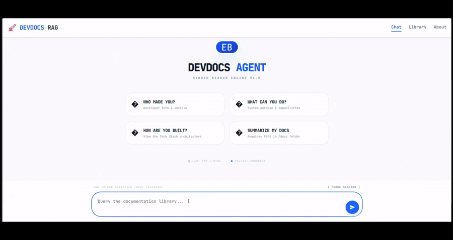
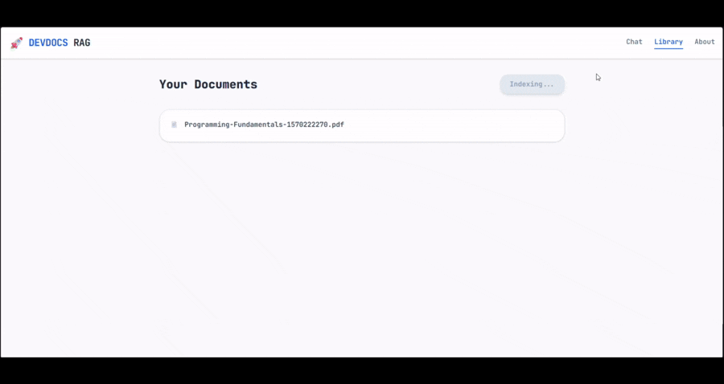
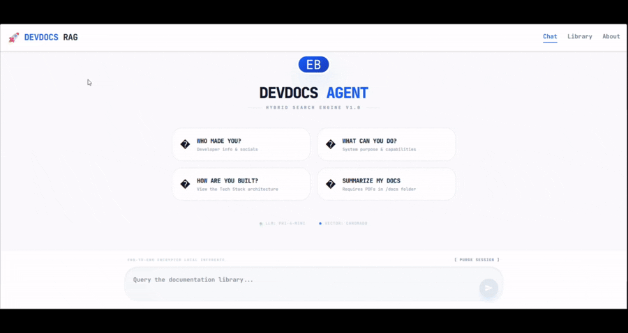

# 🤖 DEVDOCS AGENT — Local-First RAG Engine

DEVDOCS AGENT is a Local-First Retrieval-Augmented Generation (RAG) system designed for developers who want to chat with their own technical documentation completely offline.

Using Hybrid Search, OCR fallback, local LLM inference, and persistent state management, the engine provides fast and source-aware responses without sending any data to the cloud.

---

# 📸 Demo Showcase

## 🎬 Scene 1 — Identity & Instant Response

The user presses the **"Who are you?"** suggestion card from the Empty State dashboard.

The engine instantly responds with developer/project information.

### Demonstrates:
- Empty State UI
- Instant cached response
- Suggestion card interaction
- Frontend responsiveness



---

## 📄 Scene 2 — Upload + Technical Guidance

A PDF document (`FastAPI Docs.pdf`) is uploaded into the engine.

The user then asks the AI for guidance about the uploaded documentation.

### Demonstrates:
- Upload workflow
- Automatic indexing
- Hybrid retrieval
- Technical question answering
- Source-aware responses



---

## 🔄 Scene 3 — Persistent State Management

The user asks a programming fundamentals question while the AI is still processing.

During generation, the user switches between tabs/pages to demonstrate that the application state persists correctly.

### Demonstrates:
- Zustand persistent state
- Loading persistence
- Non-breaking UI transitions
- Long-running inference stability



---

## 💻 Scene 4 — CLI Version

A lightweight terminal-based version of the engine using `cli.py`.

The user interacts directly with the Python backend from the terminal.

### Demonstrates:
- CLI workflow
- Local inference
- Backend-only architecture
- Lightweight developer tooling


---

# ✨ Features

## 🧠 Hybrid Retrieval Engine

Combines:
- Semantic Vector Search
- BM25 Keyword Retrieval
- Ensemble Ranking

This allows the engine to:
- understand contextual meaning
- retrieve exact technical terms
- improve search accuracy across large technical documents

---

## 🔒 Local-First AI

Everything runs locally using:
- Ollama
- Phi-4-Mini
- ChromaDB

No cloud APIs.

No external inference.

No telemetry.

Your documents remain fully private.

---

## 📄 OCR Support

Scanned PDFs are automatically detected and processed using:

- PyTesseract
- pdf2image

The engine intelligently falls back to OCR whenever traditional extraction fails.

---

## ⚡ Persistent UI State

Powered by Zustand.

The application preserves:
- loading state
- active responses
- UI transitions

even while navigating between pages.

---

## 📚 Source-Aware Responses

Every answer includes the originating document source.

Example:

```txt
Sources:
- fastapi_docs.pdf
- programming_fundamentals.pdf
```

---

# 🛠️ Tech Stack

| Layer | Technology |
|---|---|
| Frontend | Next.js |
| Styling | Tailwind CSS, ShadCN |
| State Management | Zustand |
| Backend | FastAPI |
| LLM Runtime | Ollama |
| Model | Phi-4-Mini |
| Embeddings | Nomic-Embed-Text |
| Vector DB | ChromaDB |
| Retrieval | BM25 + Semantic Search |
| OCR | PyTesseract |
| AI Framework | LangChain |

---

# 🧠 Architecture Overview

```text
PDF Documents
      ↓
Document Parsing
      ↓
OCR Fallback (if scanned)
      ↓
Chunking
      ↓
Embeddings (Nomic-Embed-Text)
      ↓
ChromaDB
      ↓
BM25 Retrieval
      ↓
Ensemble Retriever
      ↓
Phi-4-Mini (Ollama)
      ↓
Source-Aware Response
```

---

# 🚀 Getting Started

## Prerequisites

Install:

- Python 3.10+
- Node.js 18+
- Ollama

---

# 📦 Install Ollama Models

```bash
ollama pull phi4-mini
ollama pull nomic-embed-text
```

---

# 📂 Project Structure

```txt
devdocs-agent/
│
├── frontend/
│   ├── app/
│   ├── components/
│   ├── store/
│   └── package.json
│
├── docs/
│
├── demo_gif/
│   ├── scene1.gif
│   ├── scene2.gif
│   ├── scene3.gif
│   └── scene4.gif
│
├── api.py
├── main.py
├── cli_engine.py
├── requirements.txt
├── README.md
│
├── docs_db/
└── manifest.json
```
---

# ⚙️ Full Web Experience

## 1. Start Backend

```bash
cd backend

pip install -r requirements.txt

python api.py
```

Backend runs on:

```txt
http://localhost:8000
```

---

## 2. Start Frontend

```bash
cd frontend

npm install

npm run dev
```

Frontend runs on:

```txt
http://localhost:3000
```

---

# 💻 CLI Version

Run the terminal-based engine:

```bash
cd backend

python cli_engine.py
```

---

# 📄 Adding PDFs

Place your PDFs inside:

```txt
/docs
```

The engine automatically:
- detects changes
- hashes documents
- rebuilds embeddings if needed
- triggers OCR for scanned files

---

# 🔍 Example Questions

```txt
Explain FastAPI dependency injection.

What are the fundamentals of programming?

Summarize this chapter.

How does vector search work?

Guide me through this API documentation.
```

---

# 📈 Current Optimizations

Implemented optimizations include:

- SHA256 document hashing
- Persistent vector storage
- Reusable ensemble retriever
- OCR fallback strategy
- Retrieval deduplication
- Reduced context overhead
- Local-first inference pipeline

---

# ⚠️ Current Limitations

- **Hardware Dependency**  
  Performance (inference speed, OCR, and indexing time) is directly tied to local hardware capabilities. Systems with limited VRAM or older CPUs may experience slower response times.

- **Full Index Rebuilds**  
  Document updates currently trigger a complete vector index rebuild instead of incremental indexing.

- **OCR Latency**  
  Large scanned PDFs can take significant time to process due to local image-to-text conversion overhead.

- **Memory Overhead**  
  Running the Next.js frontend, FastAPI backend, ChromaDB, and Phi-4 through Ollama simultaneously can be resource-intensive on systems with less than 16GB RAM.

- **Single-User Architecture**  
  The current implementation is designed primarily for single-user local workflows. Multi-user sessions and isolated chat histories are not yet implemented.

- **No Reranking Layer Yet**  
  The retrieval pipeline currently relies on Hybrid Ensemble Search (BM25 + Vector Retrieval) without a dedicated reranking stage such as BGE Reranker or Cohere Rerank.

---

# 🛣️ Planned Improvements

Future upgrades include:

- Incremental indexing
- Streaming responses
- Reranking pipeline
- Docker deployment
- Authentication
- Redis caching
- WebSocket support
- Multi-user architecture
- GPU acceleration improvements

---

# 🔒 Why Local-First?

DEVDOCS AGENT was designed around privacy and developer ownership.

Unlike cloud AI tools:
- documents never leave your machine
- embeddings stay local
- inference remains on-device
- no external APIs are required

Ideal for:
- proprietary documentation
- offline development
- privacy-focused workflows

---

# 👨‍💻 Developer

## Erwin Bacani

Building local-first AI systems, intelligent retrieval architectures, and developer tooling.

---

# 👨‍💻 Portfolio Context

This project was built as a personal exploration into Local-First AI systems and modern RAG architectures.

The goal was to create a fully local AI documentation assistant that prioritizes:
- data privacy
- offline capability
- fast document retrieval
- developer-focused workflows

Instead of relying on cloud APIs, the entire pipeline runs locally using Ollama, ChromaDB, and Hybrid Search techniques.

### Links

- GitHub: https://github.com/Allarezeroes26
- Portfolio: https://portfolio-j0qq.onrender.com/
- LinkedIn: https://www.linkedin.com/in/john-erwin-bacani-90853a359

---

# ⭐ Final Notes

This project focuses on:

- Retrieval-Augmented Generation (RAG)
- Hybrid Search Systems
- Local AI Infrastructure
- Developer Productivity Tools
- Privacy-First AI Workflows
